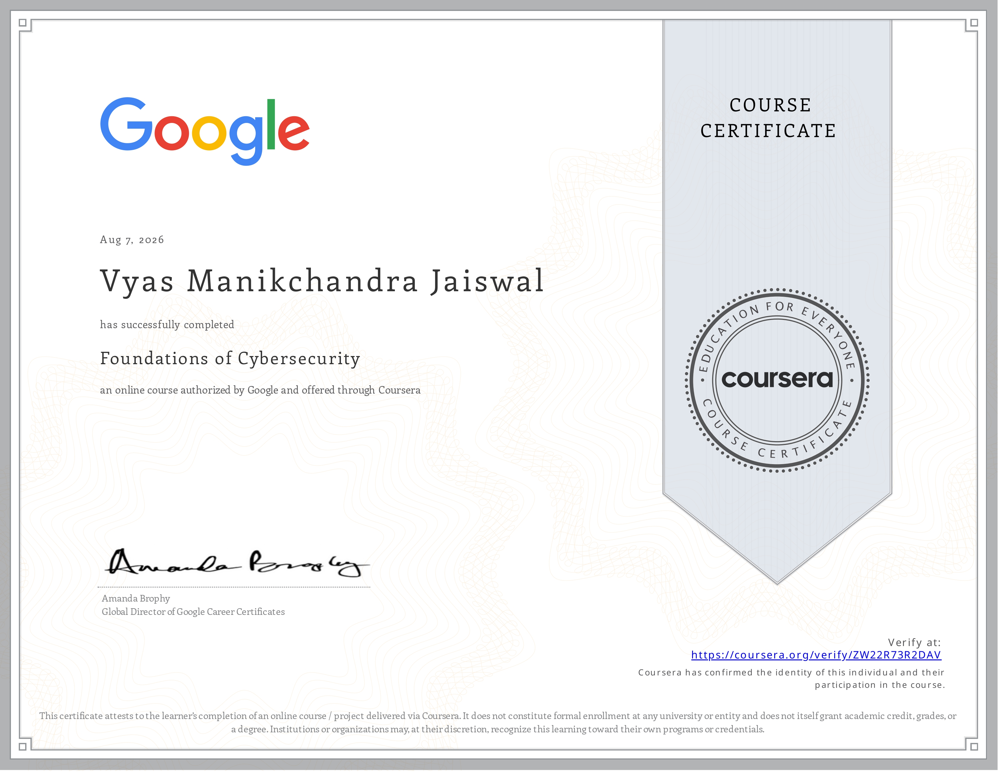

# Course 1: Foundations of Cybersecurity

  

## Executive Overview  
This document summarizes the key concepts, threat models, essential security tools, and frameworks covered in Course 1 of the Google Cybersecurity Professional Certificate.

---

## Key Technical & Strategic Takeaways

### 1. Evolution of Cyber Threats
* Cyber threats have changed from basic local viruses to complex, distributed attacks in the digital age.
* Knowing past breach patterns helps shape modern incident response and prevention strategies.

### 2. The 8 CISSP Security Domains
* **Security & Risk Management:** Setting security goals, reducing organizational risk, and ensuring compliance with regulations.
* **Asset Security:** Classifying and protecting digital and physical assets based on their risk level.
* **Security Architecture & Engineering:** Designing secure systems and environments.
* **Communication & Network Security:** Securing network channels and data transmissions.
* **Identity & Access Management (IAM):** Verifying user identities, managing access rights, and enforcing the principle of least privilege.
* **Security Assessment & Testing:** Evaluating security controls through audits and testing.
* **Security Operations:** Monitoring login attempts, managing incidents, and maintaining daily security operations.
* **Software Development Security:** Integrating security throughout each phase of the Software Development Lifecycle (SDLC).

### 3. Frameworks & Core Principles
* **CIA Triad:** Protecting Confidentiality, Integrity, and Availability across systems.
* **Security Posture:** An organization's ability to respond to changes and protect its critical assets and data.
* **NIST Frameworks:** Using structured risk management guidelines to reduce organizational vulnerability.

### 4. Essential Security Analyst Tools
* **SIEM Tools:** Centralized software that aggregates logs, monitors events, and identifies potential threats.
* **Network Protocol Analyzers:** Tools that capture and inspect network packet data.
* **SQL & Python:** Basic tools used by analysts to query database logs and automate fundamental security workflows.
