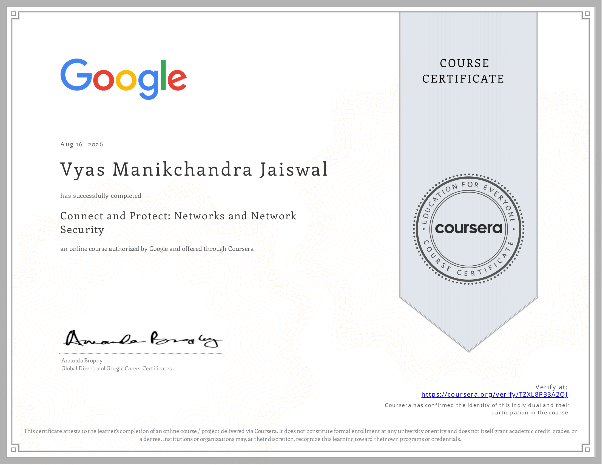

# Course 3 Summary: Connect and Protect — Networks and Network Security

  

This document synthesizes the core concepts, protocols, security vulnerabilities, packet analysis techniques, and network defense strategies covered throughout Course 3 of the Google Cybersecurity Certificate.

---

## 1. Network Architecture & Models

Network communications rely on layered frameworks to standardize data transmission across diverse hardware and software systems.

| Model Layer | OSI Model (7 Layers) | TCP/IP Model (4 Layers) | Key Protocols & Technologies |
| :--- | :--- | :--- | :--- |
| **Application** | 7. Application 6. Presentation 5. Session | Application | HTTP, HTTPS, DNS, DHCP, FTP, SSH, SMTP |
| **Transport** | 4. Transport | Transport | TCP (connection-oriented), UDP (connectionless) |
| **Network** | 3. Network | Internet | IPv4, IPv6, ICMP, IPsec, ARP |
| **Data Link / Physical** | 2. Data Link 1. Physical | Network Access / Link | Ethernet, Wi-Fi (802.11), Switches, MAC addresses, Cables |

---

## 2. Core Network Protocols & Communication Mechanics

* **TCP Three-Way Handshake:** Establishes a reliable connection between client and server:
  1. `SYN` (Synchronize): Client sends a request to initiate a session.
  2. `SYN-ACK` (Synchronize-Acknowledge): Server acknowledges request and reserves connection resources.
  3. `ACK` (Acknowledge): Client acknowledges server response; connection established.
* **Domain Name System (DNS):** Resolves human-readable domain names (e.g., `example.com`) to IP addresses (e.g., `203.0.113.22`). Operates over port 53.
* **Hypertext Transfer Protocol (HTTP/HTTPS):** Delivers web assets across port 80 (unencrypted HTTP) or port 443 (encrypted HTTPS using TLS/SSL).
* **Internet Control Message Protocol (ICMP):** Used for network diagnostics, error reporting, and operational queries (e.g., `ping`, `traceroute`).

---

## 3. Network Attack Vectors & Vulnerabilities

| Attack Type | Target Layer / Protocol | Attack Mechanism | Operational Impact |
| :--- | :--- | :--- | :--- |
| **TCP SYN Flood** | Transport (TCP) | Attacker floods target with rapid `[SYN]` packets without completing the `[ACK]` final step. | Exhausts server connection backlog table, denying service to legitimate traffic. |
| **ICMP Ping Flood** | Network (ICMP) | Mass volume of ICMP Echo Requests sent to target network interfaces. | Saturates network bandwidth and exhausts device CPU/memory. |
| **DNS Redirection / Spoofing** | Application (DNS) | Manipulating DNS cache or intercepting queries to return rogue IP addresses. | Redirects user web traffic to malicious or cloned web domains. |
| **IP Address Spoofing** | Network (IP) | Forging packet source IP headers to impersonate trusted internal machines. | Bypasses basic IP-based perimeter filtering and obscures attacker identity. |

---

## 4. Network Hardening & Defense Technologies

* **Firewalls & Port Filtering:** Enforces Access Control Lists (ACLs) to permit or block traffic based on source/destination IPs, protocols, and port numbers. Implements rate limiting to thwart flooding attacks.
* **Intrusion Detection Systems (IDS) vs. Intrusion Prevention Systems (IPS):**
  * **IDS:** Passive tool that monitors network traffic and alerts analysts to anomalous patterns or known signature matches.
  * **IPS:** Active tool deployed inline that automatically blocks, drops, or alters malicious network streams in real time.
* **Anti-Spoofing Rules:** Configures Unicast Reverse Path Forwarding (uRPF) on border routers to drop incoming packets whose source IPs do not match legitimate network routes.
* **Zero-Trust Access Controls:** Requires strict authentication (MFA), password complexity standards (NIST guidelines), and explicit network access privileges to limit lateral movement.

---

## 5. Packet Capture & Network Monitoring Tools

### Wireshark (GUI Packet Analyzer)
* **Control Flags Observed:** `[SYN]`, `[SYN, ACK]`, `[ACK]`, `[RST, ACK]`.
* **Key Function:** Diagnostic filtering, full packet decodes, and session flow reassembly (e.g., investigating HTTP `GET` requests and server error responses like `504 Gateway Time-out`).

### tcpdump (CLI Packet Analyzer)
* **Key Syntax & Flags:**
  * `Flags [S]`: Connection Start (SYN)
  * `Flags [S.]`: Synchronize-Acknowledge (SYN-ACK)
  * `Flags [.]`: Acknowledgment (ACK)
  * `Flags [P.]`: Data Push (PUSH-ACK)
  * `Flags [R]`: Connection Reset (RST)
* **Log Analysis Workflow:** Tracing DNS request/response records (`A?` queries) to track dynamic source ports and identify domain redirection events.

---

## 6. Course 3 Completed Portfolio Milestones

1. **Wireshark Log Analysis (TCP SYN Flood Incident):** Analyzed PCAP output, identified half-open handshake flood from `203.0.113.0`, and documented resulting server reset (`RST`) and timeout (`504`) conditions.
2. **tcpdump Log Analysis (DNS Redirection):** Evaluated command-line network traces to map DNS resolution changes, HTTP `GET` data pulls, and traffic redirection to suspicious endpoints.
3. **NIST Cybersecurity Framework Risk Assessment & Incident Plan:** Applied the NIST CSF 2.0 core functions (**Govern, Identify, Protect, Detect, Respond, Recover**) to formulate an enterprise remediation strategy following an ICMP Ping Flood DoS event.
