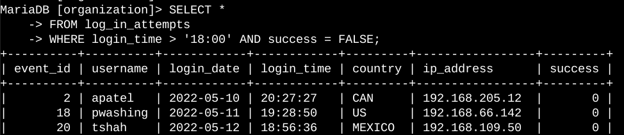
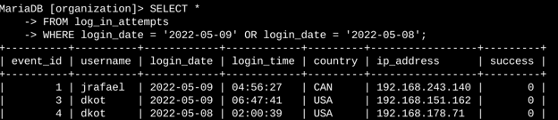
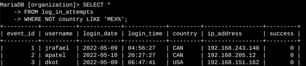
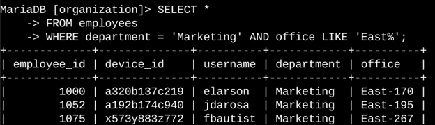
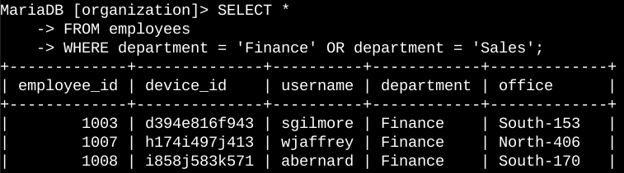
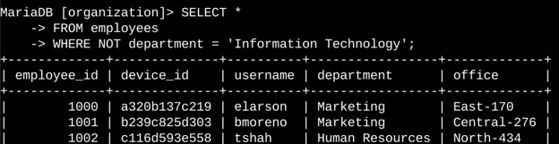

# Apply Filters to SQL Queries

## Project Description

As part of my work in cybersecurity, I need to regularly review system activity, investigate possible security issues, and identify employee computers that require security updates. SQL filters make this process easier by helping me quickly find only the records that are relevant to a particular task.

In this project, I used SQL queries to investigate login attempts and identify employees based on their department and office location.

---

## 1. Retrieve After-Hours Failed Login Attempts

A possible security incident occurred after business hours, which are considered to be after **18:00**. I needed to find all login attempts made after this time that were unsuccessful so they could be investigated further.



```sql
SELECT *
FROM log_in_attempts
WHERE login_time > '18:00'
  AND success = FALSE;
```

This query retrieves failed login attempts that happened after 18:00.

- `login_time > '18:00'` selects attempts made after business hours.
- `success = FALSE` selects only unsuccessful login attempts.
- `AND` ensures that both conditions must be true.

This helps narrow down the login records and makes it easier to identify potentially suspicious activity.

---

## 2. Retrieve Login Attempts on Specific Dates

A suspicious event was reported on **2022-05-09**. To investigate it, I needed to check login activity from both **2022-05-09** and the previous day, **2022-05-08**.



```sql
SELECT *
FROM log_in_attempts
WHERE login_date = '2022-05-09'
   OR login_date = '2022-05-08';
```

This query returns login attempts from either of the two dates.

- `login_date = '2022-05-09'` finds attempts made on May 9.
- `login_date = '2022-05-08'` finds attempts made on May 8.
- `OR` is used because I want records matching either date.

This allows the login activity around the time of the suspicious event to be reviewed.

---

## 3. Retrieve Login Attempts Outside of Mexico

While reviewing the login data, I noticed that login attempts from outside Mexico needed further investigation. I used a filter to find all login attempts from countries other than Mexico.



```sql
SELECT *
FROM log_in_attempts
WHERE NOT country LIKE 'MEX%';
```

This query excludes login attempts from Mexico and returns attempts from other countries.

I used `LIKE 'MEX%'` because the dataset can represent Mexico as either `MEX` or `MEXICO`. The `%` wildcard represents any number of characters after `MEX`.

- `LIKE 'MEX%'` matches values beginning with `MEX`.
- `NOT` excludes those matching values.
- The remaining records represent login attempts from outside Mexico.

---

## 4. Retrieve Employees in Marketing

My team needed to update computers belonging to employees in the **Marketing department** who work in the **East building**. I used SQL filters to identify the relevant employees.



```sql
SELECT *
FROM employees
WHERE department = 'Marketing'
  AND office LIKE 'East%';
```

This query returns employees who are in the Marketing department and work in the East building.

- `department = 'Marketing'` selects Marketing employees.
- `office LIKE 'East%'` matches offices in the East building, regardless of the specific office number.
- `AND` makes sure both conditions are satisfied.

---

## 5. Retrieve Employees in Finance or Sales

Employees in the **Finance** and **Sales** departments also needed security updates. Since the update applied to employees from either department, I used the `OR` operator.



```sql
SELECT *
FROM employees
WHERE department = 'Finance'
   OR department = 'Sales';
```

This query returns employees who work in either Finance or Sales.

- `department = 'Finance'` selects Finance employees.
- `department = 'Sales'` selects Sales employees.
- `OR` is used because employees from either department should be included.

Using `AND` here would not work as intended because one employee cannot normally belong to both departments at the same time.

---

## 6. Retrieve All Employees Not in IT

Finally, my team needed to apply another security update to employees who were **not** part of the Information Technology department. I used the `NOT` operator to exclude IT employees.



```sql
SELECT *
FROM employees
WHERE NOT department = 'Information Technology';
```

This query returns all employees except those who belong to the Information Technology department.

- `department = 'Information Technology'` identifies IT employees.
- `NOT` excludes those employees from the results.

This gives me the list of employees who are outside the IT department and may require the specified security update.

---

## Summary

In this project, I used SQL filters to investigate login activity and identify employee machines that required security updates. I worked with two tables: `log_in_attempts` and `employees`.

The main SQL filtering techniques I used were:

- **AND** — used when multiple conditions must be true.
- **OR** — used when either of multiple conditions can be true.
- **NOT** — used to exclude specific records.
- **LIKE** — used to match text patterns.
- **% wildcard** — used with `LIKE` to represent any number of characters.

These filters helped me reduce large amounts of data to the specific records needed for each security task, making investigations and system-update work more efficient.