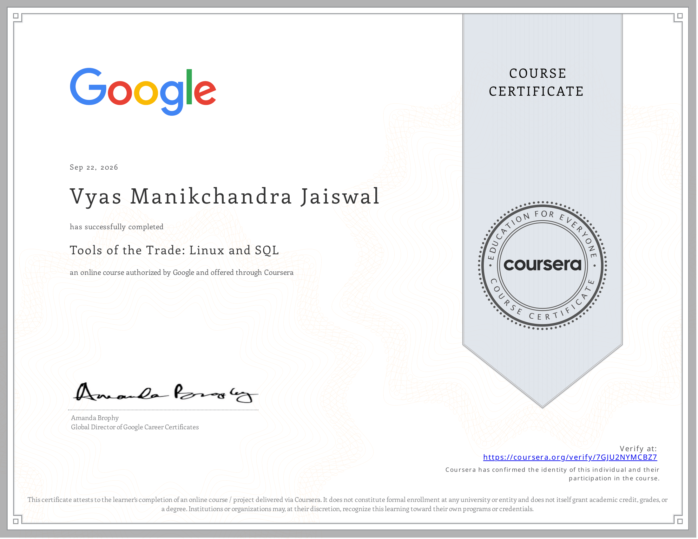

# Course 4 Summary: Tools of the Trade — Linux and SQL

<p align="center">
  
</p>

This document pulls together the key ideas, commands, and query techniques covered in Course 4 of the Google Cybersecurity Certificate. The course is built around the two tools that show up in almost every security role, day in and day out: the Linux command line and SQL. Where Course 3 was about understanding *how* networks move data and get attacked, Course 4 is about giving you the hands-on tools to actually investigate that data once it's in front of you.

---

## 1. Why Linux and SQL Matter in Security

Most enterprise servers, security appliances, and logging systems run on Linux — not because it's trendy, but because it's stable, scriptable, and gives an analyst direct access to the system without a graphical layer getting in the way. SQL, meanwhile, is the language almost every structured log store and SIEM backend speaks under the hood. Learning to navigate a Linux shell and query a database confidently isn't a "nice to have" for a security analyst — it's closer to a baseline requirement, the same way a mechanic needs to know how to use a wrench before they can diagnose an engine.

---

## 2. Linux Fundamentals

### 2.1 Distributions and Where They Fit

Linux isn't one operating system — it's a family of distributions ("distros") built on the same kernel but packaged differently depending on what they're optimized for.

| Distribution Family | Common Examples | Typical Use Case in Security |
| :--- | :--- | :--- |
| **Debian-based** | Ubuntu, Kali Linux, Parrot OS | General-purpose servers; Kali and Parrot are purpose-built for penetration testing and forensics |
| **Red Hat-based** | RHEL, CentOS, Fedora, Rocky Linux | Enterprise production servers, where long-term stability and vendor support matter most |
| **Independent / Other** | openSUSE, Arch Linux | Custom or highly configurable environments, often used by advanced users |

### 2.2 The Filesystem Hierarchy

Linux organizes everything — files, devices, running processes — into a single tree starting at the root directory (`/`). Knowing this layout makes it much faster to figure out where logs, configuration files, or binaries actually live during an investigation.

| Directory | Purpose |
| :--- | :--- |
| `/` | The root of the entire filesystem; every other directory branches from here |
| `/home` | Personal directories for each user account |
| `/etc` | System-wide configuration files (a frequent target for both admins and attackers) |
| `/var` | Variable data that changes often, including most system and application logs (`/var/log`) |
| `/tmp` | Temporary files, cleared on reboot — also a common place for malware to stage itself |
| `/bin` & `/usr/bin` | Essential executable programs and user command binaries |
| `/root` | The home directory reserved for the root (superuser) account |
| `/dev` | Device files representing hardware, such as disks and terminals |

### 2.3 Core Command-Line Skills

The shell (commonly Bash) is where most real Linux work happens. A working command of these command groups covers the vast majority of day-to-day tasks:

* **Navigation:** `pwd` (show current directory), `cd` (change directory), `ls`, `ls -l` (long listing with permissions), `ls -a` (show hidden files).
* **File and directory management:** `touch`, `mkdir`, `cp`, `mv`, `rm`, `rm -r` (recursive delete).
* **Viewing file content:** `cat` (print whole file), `less` (scrollable viewer), `head` / `tail` (first or last lines — `tail -f` is especially useful for watching a live log).
* **Searching and filtering:** `grep` (search text by pattern), `find` (locate files by name, type, or attributes), `wc` (word/line/character counts), `sort`, `uniq`.
* **Combining commands:** the pipe operator `|` sends the output of one command into another, and redirection operators (`>`, `>>`) write output to a file instead of the screen. Chaining commands like this — for example, `cat auth.log | grep "Failed password" | wc -l` — is how a lot of quick log triage actually gets done in practice.

### 2.4 Permissions and Ownership

Every file and directory on a Linux system carries a permission set that controls who can read, write, or execute it — and getting this wrong is one of the most common ways systems get compromised.

| Symbol | Permission | Octal Value |
| :--- | :--- | :--- |
| `r` | Read | 4 |
| `w` | Write | 2 |
| `x` | Execute | 1 |
| `-` | No permission | 0 |

Permissions are assigned separately to the file's **owner**, its **group**, and **everyone else**, which is why a long listing looks like `rwxr-xr--`. The `chmod` command changes these permissions (either symbolically, like `chmod u+x script.sh`, or numerically, like `chmod 754 script.sh`), while `chown` changes who owns a file. Elevated actions typically go through `sudo`, which grants temporary root-level privileges to an authorized user rather than requiring them to log in as root directly — a small but important security safeguard in itself.

---

## 3. Introduction to SQL and Relational Databases

### 3.1 What a Relational Database Actually Is

A relational database stores data in tables made up of rows (individual records) and columns (the attributes of each record). Tables can be linked to one another through shared key values — a **primary key** uniquely identifies each row in its own table, and a **foreign key** references that same value from a related table. This relational structure is exactly what lets SQL pull connected information — say, a user account and the login events tied to it — out of two separate tables in a single query.

### 3.2 Core Query Syntax

Every SQL query starts from the same basic skeleton: choose the columns you want with `SELECT`, name the table with `FROM`, and end the statement with a semicolon.

```sql
SELECT firstname, lastname, email
FROM customers;
```

From there, `WHERE` narrows results down to rows matching a condition, and `ORDER BY` controls how the results are sorted (ascending by default, or descending with `DESC`):

```sql
SELECT firstname, lastname, title, email
FROM employees
WHERE title = 'IT Staff'
ORDER BY lastname;
```

### 3.3 Pattern Matching and Filtering

Exact matches aren't always enough, which is where the `LIKE` operator and wildcards come in — `%` stands in for any number of characters, and `_` stands in for exactly one:

```sql
-- Matches 'IT Staff', 'IT Manager', etc.
SELECT * FROM employees WHERE title LIKE 'IT%';
```

Comparison operators (`=`, `>`, `<`, `>=`, `<=`, `<>`) and the `BETWEEN` keyword handle numeric and date filtering — useful for things like isolating login attempts within a specific time window or accounts created after a certain date. Logical operators (`AND`, `OR`, `NOT`) let those conditions be combined or excluded as needed.

### 3.4 Joining Tables

Joins are where SQL really earns its place over flat text filtering — they let you pull matching data across multiple tables at once, based on a shared key.

| Join Type | What It Returns |
| :--- | :--- |
| `INNER JOIN` | Only rows with a match in **both** tables |
| `LEFT JOIN` | All rows from the left table, with matches from the right where they exist (`NULL` otherwise) |
| `RIGHT JOIN` | All rows from the right table, with matches from the left where they exist (`NULL` otherwise) |
| `FULL OUTER JOIN` | Every row from both tables, matched or not |

```sql
SELECT employees.firstname, machines.device_id
FROM employees
INNER JOIN machines ON employees.device_id = machines.device_id;
```

### 3.5 Aggregate Functions

Aggregate functions collapse many rows into a single summary value, which is exactly what you want when you need a count or a total rather than a row-by-row list — for example, tallying how many failed login attempts came from a given country:

```sql
SELECT COUNT(firstname)
FROM customers
WHERE country = 'USA';
```

`AVG()` and `SUM()` work the same way for averages and running totals.

> A more detailed breakdown of SQL filtering, wildcards, comparison operators, and joins — including a direct comparison of SQL filtering versus Linux command-line filtering — is documented separately in the **[Module 4 SQL Study Guide](./Module4_SQL_Database_Querying_Study_Guide.md)**.

---

## 4. SQL vs. Linux: Choosing the Right Tool

Both tools can filter data, but they're built for different jobs, and knowing which one fits the situation is part of the skill itself.

| Consideration | SQL | Linux Command Line |
| :--- | :--- | :--- |
| **Best suited for** | Structured, tabular data already living in a database | Raw text files, logs, or output not stored in a database |
| **Structure** | Data is cleanly separated into columns | Output is unstructured lines of text |
| **Relating data** | Native support for joining multiple tables together | No built-in way to relate separate files |
| **Typical security use** | Querying centralized log databases, SIEM backends, asset inventories | Parsing raw log files, quick on-host investigation, scripting |

---

## 5. Course 4 Completed Portfolio Milestones

1. **Linux Command-Line Investigation:** Practiced navigating the filesystem, filtering log output with `grep` and pipes, and interpreting file permissions during a simulated host investigation.
2. **User and Permission Management Exercise:** Applied `chmod`, `chown`, and `sudo` to correct a misconfigured permission set and restrict unauthorized file access.
3. **SQL Query Practice (Chinook Database):** Wrote `SELECT`, `WHERE`, `ORDER BY`, and `JOIN` queries against a sample relational database to retrieve and filter customer, employee, and invoice records.
4. **Data Filtering Capstone:** Compared SQL and Linux-based filtering approaches on the same dataset to determine the more efficient method for a given security scenario.

---

## 6. Looking Ahead

Course 4 rounds out the technical toolkit that the rest of the certificate builds on — Linux for working directly on a host, and SQL for querying the structured data that sits behind most security tooling. The next courses shift focus toward asset and threat detection, incident response, and applying these tools in more realistic, end-to-end investigative scenarios.
